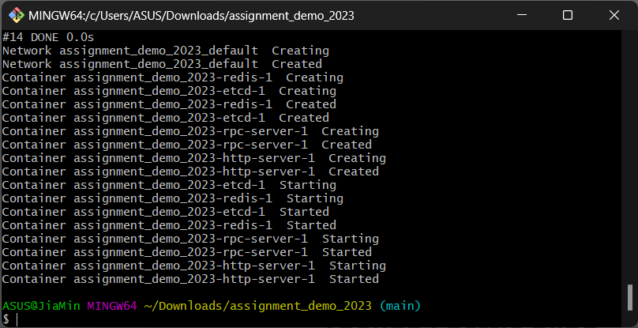
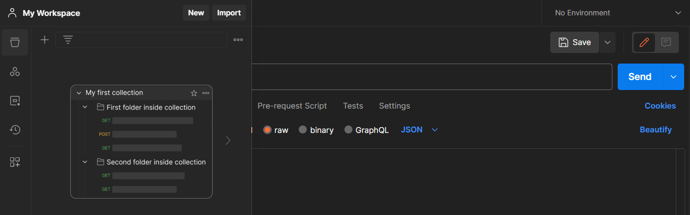
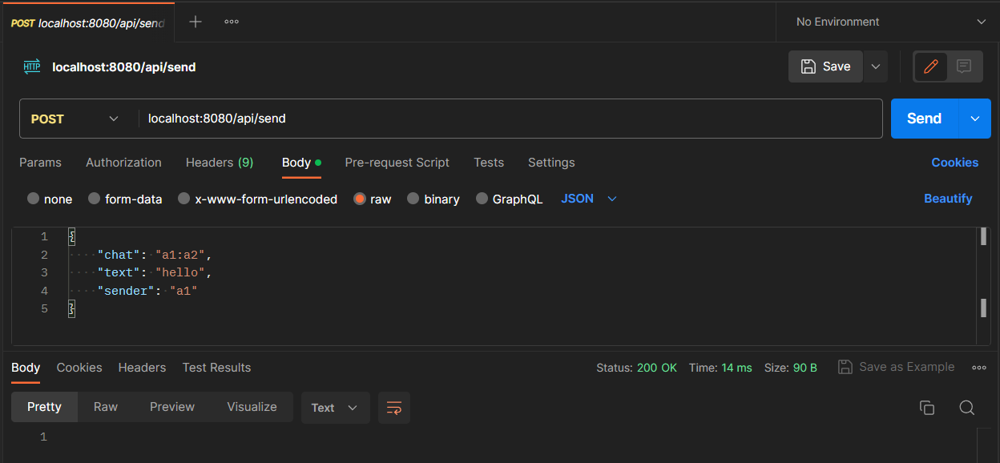
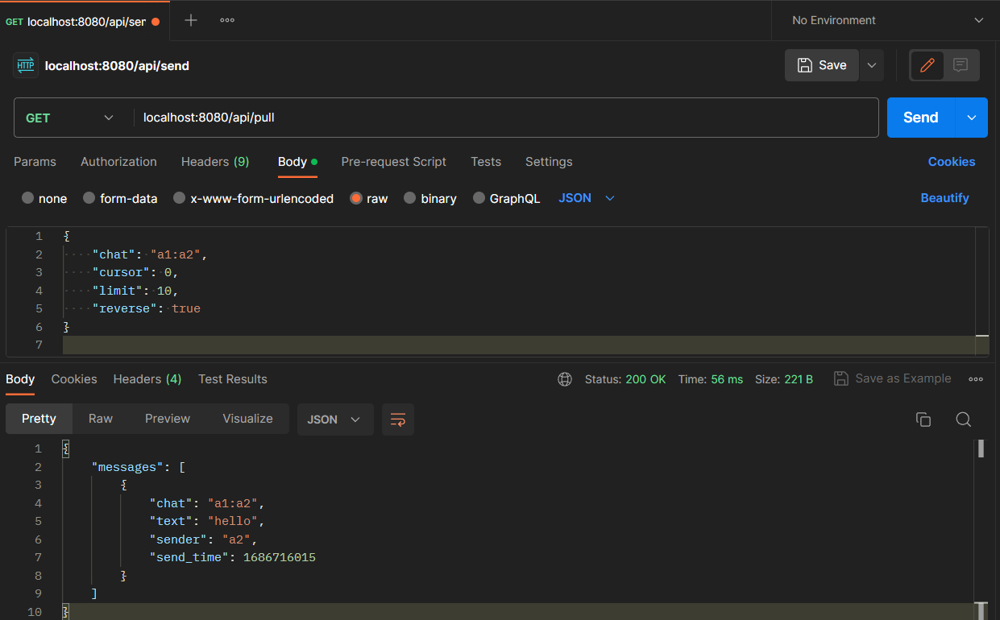
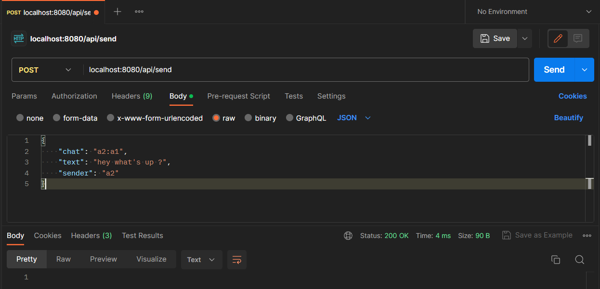
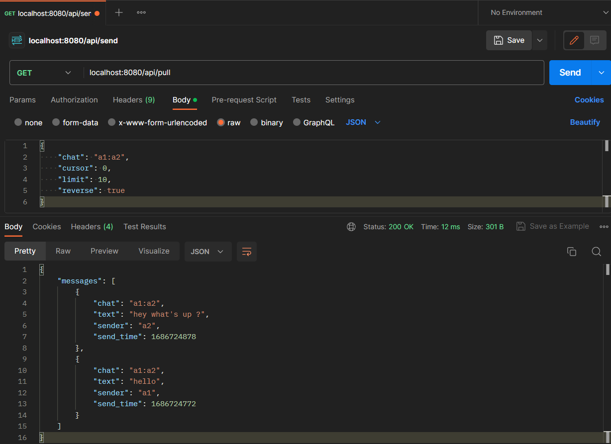
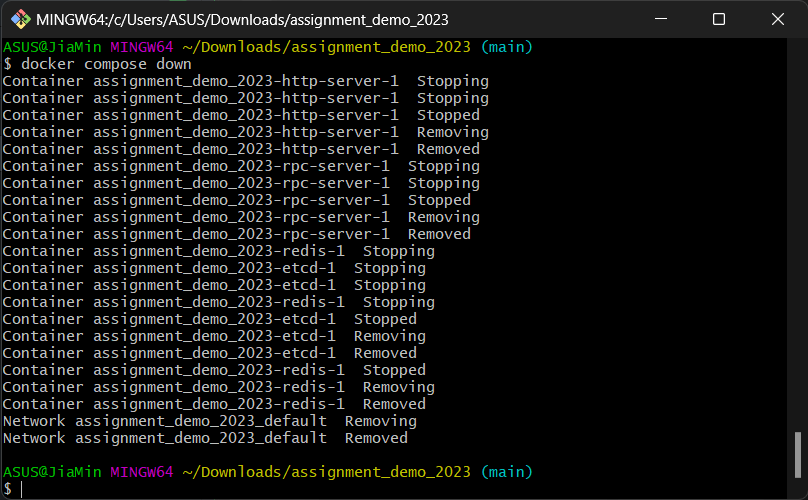

# TikTok Tech Immersion Program Assignment 2023

## Overview
This project aims to design and develop an instant messaging (IM) system using Golang. The focus is on implementing the backend side of the system, specifically the core message features. The front-end part and the account/authentication functionality are excluded from this assignment.

## Usage 
### Prerequisite
1. [Go](https://go.dev/doc/install)
2. [Docker Desktop](https://www.docker.com/products/docker-desktop/)
3. [Postman](https://www.postman.com/downloads/)
4. [Git Bash](https://git-scm.com/downloads)

### Setup
1. Clone the repository using this command:
  > `git clone https://github.com/Jiamin88/assignment_demo_2023.git --config core.autocrlf=false`.

2. Run the following command in the root directory of the project to start Docker.
  > `docker-compose -f docker-compose.yml up -d --build`  
    

3. Open Postman to check that the initial APIs are functional.
    
   Import the following request to Postman using the cURL format.
   - Sending a message from a1 to a2.
    ```
    curl --location 'localhost:8080/api/send' \
    --header 'Content-Type: application/json' \
    --data '{
        "chat": "a1:a2",
        "text": "hello",
        "sender": "a1"
    }'
    ```
     

  - Pulling messages from the same room.  
    > GET localhost:8080/api/pull
    ```
    {
      "chat": "a1:a2",
      "cursor": 0,
      "limit": 10,
      "reverse": true
    }
    ```
    
     
  - Sending multiple messages from the same room.
    
      
    
         
4. Run the following command to shut down the Docker at the end.
  > `docker compose down`
  

### Other Tech Stacks
1. Hertz framework (using Protobuf protocol) for HTTP-server
2. Kitex framework (to handle RPC calls) for RPC-server
3. Redis for database
